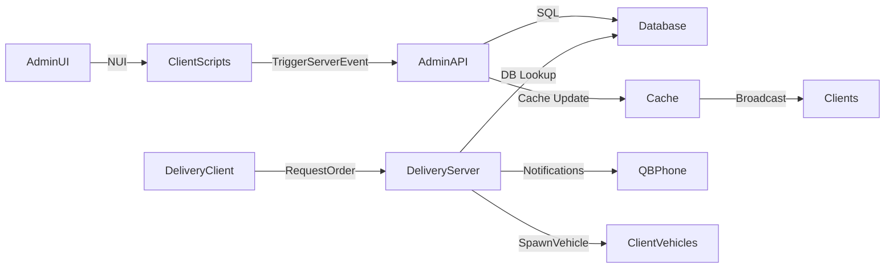

# WS-Shopsystem Admin & Creator Panel Konzept

## Überblick

Dieses Dokument beschreibt die Architektur, Datenmodelle und UX-Flows für das neue Admin-/Creator-Panel des WS-Shopsystems. Ziel ist es, Shop-Administratoren ein vollständig UI-basiertes Werkzeug zu geben, um Geschäfte, Lieferaufträge, Fahrzeuge und Spielerprogression zu verwalten, ohne manuelle Änderungen in `config.lua` oder der Datenbank vornehmen zu müssen.

## Ziele

- **Zentralisierte Verwaltung** aller Shops, NPCs, Fahrzeuge, Produkte und Lieferketten in einer dedizierten UI.
- **Datenbankgestützte Persistenz** für sämtliche Shop- und Fortschrittsdaten.
- **Flexible Konfiguration** von Standorttypen, Lieferpunkten, Fahrzeugkapazitäten und Level-Gating.
- **Integrierte Kommunikationswege** über QB-Phone (Bestellungen, niedriger Bestand, Lieferstatus).
- **Erweiterbare Schnittstellen** für zukünftige Features (z. B. zusätzliche Fahrzeugklassen, neue Produktkategorien).

## UX-Flows

### Startbildschirm
- Liste aller Shops mit Schnellinfos (Name, Standort, aktiver Status, Lagerauslastung, zugewiesene NPCs).
- Aktionen: Shop öffnen, Shop deaktivieren, neuen Shop anlegen, Spielerübersicht, Systemeinstellungen.

### Shop-Detailansicht
- Tabs/Abschnitte: **Allgemein**, **Zonen & Punkte**, **NPCs**, **Fahrzeuge**, **Produkte**, **Lieferlogik**, **Level & XP**, **Spieler**.
- Seitenleiste mit Statusindikatoren (z. B. Lagerbestand, offene Lieferaufträge, durchschnittliche Lieferzeit).

### Shop-Erstellung/-Bearbeitung
1. **Allgemein**: Shop-Name, Typ (z. B. Lebensmittel, Elektronik), Standort-Koordinaten, Öffnungszeiten.
2. **Zonen & Punkte**: Marker für Shop-Zone, Depot-Zone, Lieferpunkte (mehrere pro Shop möglich, konfigurierbare Gewichte für Zufallsauswahl), optionale Spawnpunkte für NPCs/Vehicles.
3. **NPCs**: Auswahl aus einer NPC-Klassenbibliothek (mit Vorschau), Zuordnung mehrerer NPCs pro Shop möglich.
4. **Fahrzeuge**: Erstellung von Fahrzeugpools nach Level/XP; definierte Kapazitäten, erlaubte Produkte, Spawn-Konfiguration.
5. **Produkte**: Produktliste mit Preis, Kategorie, Lagerlimit, Standardliefermenge, Level-Gating.
6. **Lieferlogik**: Definition von Lieferaufträgen pro Produktgruppe, Fahrzeugzuordnung, Anzahl paralleler Aufträge, Coords für Depot-/Lieferpunkte.
7. **Level & XP**: Konfiguration von XP-Gating (XP-Kosten, Levelgrenzen, Freischaltung von Produkten/Fahrzeugen), Multiplikatoren für Spielerlevel.
8. **Spieler**: Anzeige/Verwaltung der Shop-spezifischen Spielerprogression (XP, Level, Blacklist/Whitelist, Entfernung aus Shop).

### Spielerverwaltung
- Globale Liste aller Spieler mit Shop-Zugehörigkeiten, XP, Level, Auftragsverlauf.
- Aktionen: XP/Level anpassen, Shopzuweisung ändern, Spieler aus Shop entfernen, Historie einsehen.

### Systemeinstellungen
- Globale Defaults (z. B. Standardlieferzeiten, Default-Depot-Punkte, globale NPC-Pools).
- Konfiguration von QB-Phone-Vorlagen (E-Mail/Benachrichtigungstexte).
- Rollen & Berechtigungen für Adminpanel-Zugriff.

## Datenmodell

### Neue Tabellen / Migrationen

1. **`ws_shops`**
   - `id` (PK)
   - `name`
   - `type`
   - `status` (aktiv/inaktiv)
   - `coords` (JSON für Mittelpunkt)
   - `zone` (JSON: Poly/Zylinder)
   - `open_hours` (JSON)
   - `created_at`, `updated_at`

2. **`ws_shop_locations`**
   - `id` (PK)
   - `shop_id` (FK → `ws_shops.id`)
   - `location_type` (enum: depot, delivery, spawn, npc, etc.)
   - `coords` (JSON)
   - `radius` / `heading`
   - `weight` (für Zufallsauswahl)

3. **`ws_npc_classes`**
   - `id` (PK)
   - `label`
  - `model`
   - `animation`
   - `metadata` (JSON)

4. **`ws_shop_npcs`**
   - `id` (PK)
   - `shop_id`
   - `npc_class_id`
   - `position` (Koordinate in Shop)

5. **`ws_vehicle_pools`**
   - `id`
   - `shop_id`
   - `label`
   - `vehicle_model`
   - `capacity` (Slots/Volumen)
   - `min_level`
   - `max_level`
   - `xp_cost`
   - `metadata`

6. **`ws_products`**
   - `id`
   - `label`
   - `category`
   - `default_price`
   - `default_limit`
   - `metadata`

7. **`ws_shop_products`**
   - `id`
   - `shop_id`
   - `product_id`
   - `price`
   - `stock_limit`
   - `delivery_config` (JSON: Menge, Fahrzeugbindung, Lieferpunkte)
   - `min_level`
   - `xp_reward`

8. **`ws_player_progress`**
   - `id`
   - `citizenid`
   - `shop_id`
   - `xp`
   - `level`
   - `last_activity`

9. **`ws_delivery_orders`**
   - `id`
   - `shop_id`
   - `product_id`
   - `vehicle_pool_id`
   - `status` (pending, active, completed, failed)
   - `assigned_player`
   - `created_at`
   - `started_at`
   - `completed_at`
   - `payload` (JSON: Itemliste mit Mengen, Randomized Routes)

10. **`ws_notifications`** (optional für Historie)
    - `id`
    - `shop_id`
    - `type`
    - `citizenid`
    - `payload`
    - `created_at`

### JSON-Strukturen
- Koordinaten als `{ x, y, z, w? }`.
- Zonen optional als `{ type: "poly", points: [...] }` oder `{ type: "circle", center: {...}, radius }`.
- Lieferkonfiguration: `{ vehiclePoolIds: [...], itemSets: [{ items: [{ name, amount }], weight }], deliveryPoints: [...], maxActive: 2 }`.

## Server-Architektur

### Module
- **`server/main.lua`**: Exporte für UI, Sync mit QB-Core, Routing der Admin-APIs.
- **`server/cache.lua`**: Cache Layer (Shops, Produkte, NPCs, Fahrzeuge) + Invalidierung nach Änderungen.
- **`server/deliveries.lua`**: Delivery-Management, Itemliste nach Fahrzeugkapazität, Spawn/Marker-Fix, Trigger für Notifications.
- **`server/notifications.lua`** (neu): Schnittstelle für QB-Phone-Mails, Templates, Throttling.
- **`server/admin.lua`** (neu): CRUD-Operationen für Shops, Produkte, NPCs, Fahrzeuge, Level.
- **`server/db.lua`** (neu): Abstraktionsschicht für SQL (MySQL.Async) mit vorbereiteten Statements.

### API-Endpunkte (Server Events/Callbacks)
- `ws-shopsystem:admin:getShops`
- `ws-shopsystem:admin:getShopDetail`
- `ws-shopsystem:admin:createShop`
- `ws-shopsystem:admin:updateShop`
- `ws-shopsystem:admin:deleteShop`
- `ws-shopsystem:admin:getPlayers`
- `ws-shopsystem:admin:updatePlayerProgress`
- `ws-shopsystem:admin:getConfigOptions` (NPC-Klassen, Fahrzeugmodelle, Produktkatalog)
- `ws-shopsystem:admin:saveVehiclePool`
- `ws-shopsystem:admin:saveProduct`
- `ws-shopsystem:admin:saveDeliveryConfig`
- `ws-shopsystem:admin:rebuildCache`

### Delivery Flow
1. Admin erstellt Lieferkonfiguration mit Itemsets und zugehörigen Fahrzeugpools.
2. Spieler startet Auftrag → Server generiert Itemliste basierend auf Fahrzeugkapazität und Produktregeln.
3. Fahrzeugspawn: `server/deliveries.lua` validiert Spawnpunkt, sendet Event an Client; Fallback bei blockierten Spots.
4. Client setzt Wegpunkte für Depot-/Lieferpunkte (mehrere Routen möglich).
5. Abschluss → XP/Geld, Lagerbestand aktualisieren, Benachrichtigung triggern.

## Client-Architektur

### Admin UI
- Eigenständige HTML/JS/CSS-App (z. B. `html/admin/index.html`).
- Nutzung von Vue/React (oder Vanilla JS) + Fetch/NUI für Kommunikation.
- Komponenten: Shop-Liste, Karteneditor (Leaflet/Mapbox/Custom GTA Map), Formular-Builder für Produkte/Fahrzeuge.
- State-Management (z. B. Pinia/Vuex oder einfache Store-Implementierung) für Shop- und Spieler-Daten.

### Deliveries Client Fixes
- Sicherstellen, dass `client/deliveries.lua` beim Starten eines Auftrags:
  - Fahrzeug-Spawnpunkt aus gewähltem Pool erhält (Fallback, wenn belegt).
  - Wegpunkt/Blip für Depot- und Lieferziele setzt.
  - Lade- und Entlade-Animationen/Prompts aktualisiert.

### Notifications Client
- Empfang von QB-Phone-Mails über `TriggerClientEvent('qb-phone:client:CustomMail', ...)`.
- UI-Hinweise (z. B. `QBCore.Functions.Notify`) bei niedrigen Beständen oder abgeschlossenen Lieferungen.

## Datenflüsse

## QB-Phone Benachrichtigungen

| Event | Empfänger | Inhalt | Trigger |
|-------|-----------|--------|---------|
| Kaufbestätigung | Spieler | Produkte, Preis, Restlager | `server/main.lua` bei Kaufabschluss |
| Niedriger Lagerbestand | Shop-Admin | Produktname, aktueller Bestand, empfohlene Bestellung | `server/main.lua` sobald `stock < threshold` |
| Lieferungs-Start | Spieler | Fahrzeug, Lieferpunkte, Itemliste | `server/deliveries.lua` bei Auftragsstart |
| Lieferungs-Abschluss | Spieler & Admin | Ergebnisse, XP, Status | `server/deliveries.lua` bei Abschluss |

## Berechtigungen & Sicherheit

- Zugriff auf Adminpanel über QB-Management Rollen oder ACL-Einträge (`config.AdminRoles`).
- Serverseitige Validierung aller eingehenden Daten (z. B. Koordinatenbereich, Produkt-IDs, Level-Grenzen).
- Audit-Log über `ws_notifications` oder dedizierte Tabelle (`ws_admin_logs`).

## Schrittweise Implementierung

1. **Datenbankmigrationen**: Tabellen erstellen, bestehende Daten übernehmen.
2. **Server-Cache & APIs**: CRUD-Endpunkte, Validierung, Cache-Invalidierung.
3. **Delivery-Überarbeitung**: Itemlisten, Fahrzeug-Spawn-Fixes, Blip-Management.
4. **Benachrichtigungen**: QB-Phone-Templates & Trigger implementieren.
5. **Admin UI**: Skeleton + Shop-Liste → modulare Erweiterung pro Tab.
6. **Spielerprogression**: XP-/Levelsystem finalisieren, UI für Verwaltung.
7. **QA & Dokumentation**: Testpläne, Benutzerhandbuch, zukünftige Erweiterungen.

## Offene Fragen

- Sollen NPC-Klassen zentral (global) oder pro Shop definierbar sein?
- Benötigen wir Mehrsprachigkeit im Adminpanel? (Locale-Integration)
- Sollen Lieferaufträge zwischen Shops geteilt werden können?
- Wie werden Standardprodukte initial erstellt? (Seed-Skript oder UI)

---

Dieses Konzept dient als Grundlage für die Implementierung. Vor dem Coding sollten offene Fragen geklärt und Mockups für die Admin UI erstellt werden.
